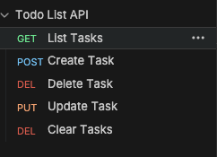

# todolist

API REST simples para gerenciamento de tarefas, feita com Spring Boot como primeiro projeto na tecnologia.

## Endpoints

| Método | Rota              | Descrição                    |
|--------|-------------------|------------------------------|
| GET    | /tasks            | Lista todas as tarefas       |
| POST   | /tasks            | Cria uma nova tarefa         |
| PUT    | /tasks/{taskId}   | Atualiza a descrição         |
| DELETE | /tasks/{taskId}   | Remove uma tarefa            |
| DELETE | /tasks            | Remove todas as tarefas      |

## Como rodar

```bash
./mvnw spring-boot:run
```

A aplicação sobe em `http://localhost:8080`.

## Coleção Bruno

A pasta `bruno/` contém a coleção com todas as requisições. Importe-a no Bruno e selecione o ambiente `Local`.


